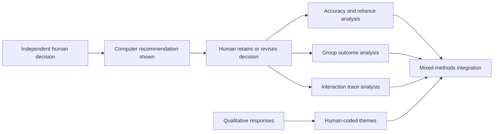

# Human-AI Loan Collaboration Analysis

A mixed-methods investigation of how people use, resist, and revise AI advice during loan-application review, with emphasis on accuracy, appropriate reliance, group outcomes, and human oversight.

> **Research boundary:** this public repository contains code and documentation, not participant-level research data. The study is an experimental analysis and does not establish that any lending process is fair, lawful, causal, or suitable for deployment.

## Research at a glance

| Element | Study evidence |
|---|---:|
| Participants | 22 |
| Applicant profiles | 100 |
| Decision rows | 2,200 |
| Matched three-stage cases | 1,920 |
| Qualitative responses | 210 |
| Timestamped interaction events | 6,410 |

### Headline findings

- Final human-AI accuracy was **66.61%**, compared with **65.42%** for initial human judgement and **60.73%** for the computer recommendation.
- The final-minus-initial improvement was small and uncertain; the final decisions performed clearly better than the computer alone.
- Among 700 initial human-AI disagreements, **60%** were resolved through appropriate acceptance or appropriate resistance.
- Underreliance occurred more often than overreliance: 208 versus 72 cases among the 700 initial disagreements.
- The observed Purple-minus-Orange approval-rate gap was approximately **+40 percentage points** at the computer stage, **-3 points** initially, and **+4.19 points** finally.
- These group comparisons are descriptive. The background-assignment mechanism is not independently documented, so no causal discrimination claim is made.

## Decision process



The analysis distinguishes initial disagreement from final disagreement. The four reliance categories are defined only for cases where the initial human decision disagreed with the computer:

- **Appropriate acceptance:** the computer was correct and the participant moved toward it.
- **Appropriate resistance:** the computer was incorrect and the participant retained the correct initial decision.
- **Overreliance:** the participant followed an incorrect computer recommendation.
- **Underreliance:** the participant resisted a correct computer recommendation.

## Analytical workflow

The research notebook covers:

1. controlled data discovery, loading, and validation;
2. reconciliation of initial, computer, explicit-final, and effective-final decisions;
3. decision-flow, accuracy, reliance, and participant-level summaries;
4. logistic regression with two-way cluster-robust uncertainty;
5. regularised and grouped predictive validation;
6. CatBoost, SHAP, and permutation-importance analysis;
7. observed Orange-Purple group comparisons and sensitivity checks;
8. human-validated qualitative coding and reliability assessment;
9. decision-theme integration, limitations, checksums, and output manifests.

Predictive explanations are treated as descriptions of model behaviour, not causal evidence or complete fairness tests.

## Independent double-coding

The primary researcher coded all 210 survey/free-text responses using a 23-code framework. A second human coder independently coded a 52-response sample, or 24.8%, using the same codebook.

Agreement before consensus covered 1,196 binary coding decisions, with six differences and 99.50% overall raw agreement. Cohen's kappa ranged from 0.857 to 1.000 for the 11 codes with category variation; kappa was undefined for the 12 codes unused by both coders.

The six differences were subsequently resolved through consensus. These results underpin the six original qualitative themes. They do not apply to the separate deterministic rule-based twelve-theme classification.

## Repository paths

```text
.
├── data/README.md
├── docs/
│   ├── data_access.md
│   ├── data_dictionary.md
│   └── public_reproducibility.md
├── examples/synthetic_reliance_demo.py
├── src/human_ai_loan_analysis/
│   ├── reliance.py
│   └── schema.py
├── tests/
├── human_ai_loan_collaboration_analysis_public.ipynb
├── CITATION.cff
├── LICENSE
└── pyproject.toml
```

The notebook remains the complete research narrative. The installable package contains small, deterministic, public-safe utilities that can be tested using synthetic decisions.

## Public smoke test

Python 3.11 or later is recommended.

```bash
python -m venv .venv
source .venv/bin/activate
python -m pip install -e ".[dev]"
pytest
python examples/synthetic_reliance_demo.py
```

The smoke test verifies the public reliance-classification logic. It does not reproduce the study findings and must not be interpreted as research data.

## Running the complete research notebook

Researchers with authorised access to the pseudonymised source files can install the additional research dependencies:

```bash
python -m pip install -e ".[research]"
jupyter lab
```

Open `human_ai_loan_collaboration_analysis_public.ipynb`. The notebook searches recursively from its working directory for authorised files placed under `data/`. See [docs/data_access.md](docs/data_access.md) and [docs/data_dictionary.md](docs/data_dictionary.md).

## Public-release safeguards

- Do not commit participant-level records, transcripts, quotations, session information, or generated participant-level outputs.
- Do not publish transcript filenames, timestamps, local paths, or personal coder names.
- Preserve the distinction between the independently double-coded 23-code analysis and the deterministic twelve-theme classification.
- Preserve the distinction between initial and final human-AI disagreement.
- Treat all results as specific to the experimental design and available data.

## Limitations

- The restricted data prevent complete public reproduction.
- The sample contains 22 participants and repeated applicant profiles.
- Group labels and the background-assignment mechanism impose limits on fairness interpretation.
- Predictive importance does not establish causality or ethical acceptability.
- The public synthetic example demonstrates code behaviour only.

## Citation

Citation metadata are provided in [CITATION.cff](CITATION.cff).

## Licence

The code is available under the MIT License. Access to or use of the controlled research data is not granted by this licence.
